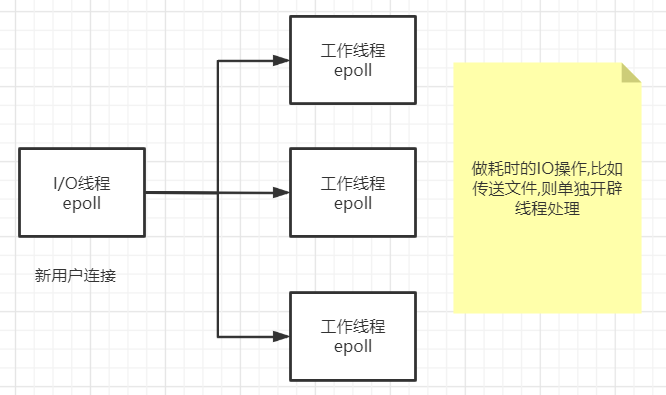
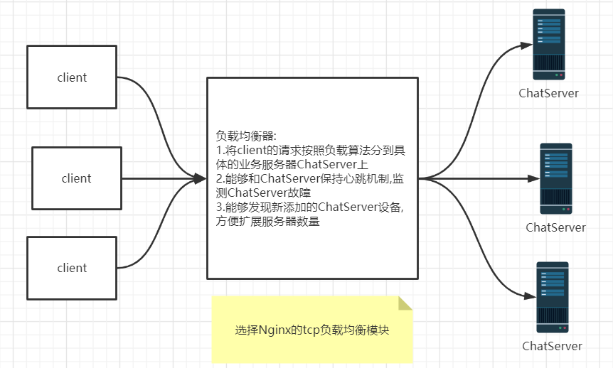
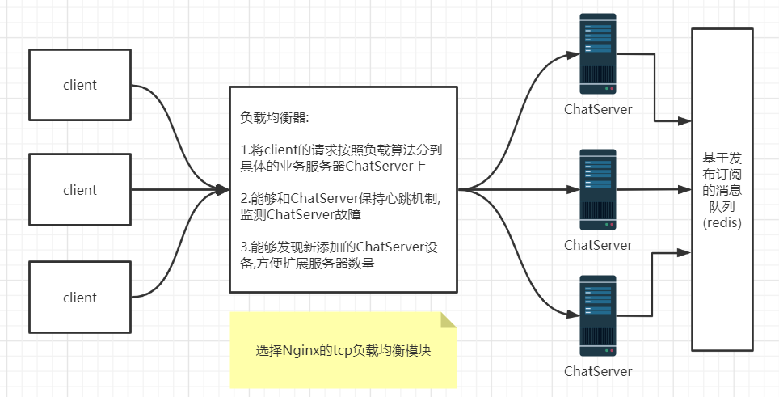
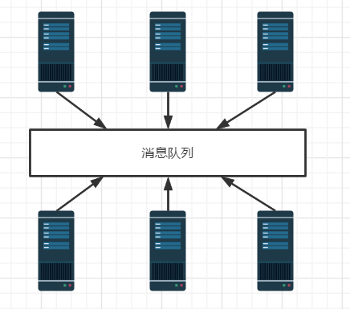
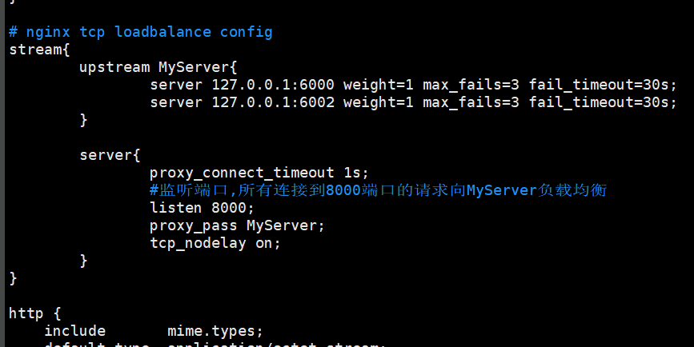

大二下学习C++Linux编程后一直想学习并完成的项目，奈何当时接触的项目较少，对架构较难理解，大三学习了Java的spring框架，对项目架构设计有了一定的认识，重新学习该项目，目的是回顾一些C++知识，学习Redis和Nginx在项目的具体应用。

# 高并发网络库



# CMake

vscode 安装CMake和CMake Tools 插件

```bash
gcc -I头文件搜索路径 -L库文件搜索路径 -lmuduo_net  
#/usr/include   /usr/local/include
#/usr/lib usr/local/lib 这几个路径默认搜索,不需要加
```

使用命令进行编译可执行文件时

```bash
g++ -o test -g test.cpp -I/usr/include -L/usr/lib -lmuduo_net -lmuduo_base -lpthread
```

* 编译目标文件
* 编译选项
* 源文件
* 头文件搜索路径
* 库文件搜索路径
* 链接库

使用CMake,编写CMakeLists.txt

```cmake
# 最顶版本要求
# cmake_minmum_required(VERSION 3.0)
# 项目名称
# project(main)
# 设置编译选项
# set(CMAKE_CXX-FLAGS ${CMAKE_CXX_FLAGS} -g)
# 配置头文件搜索路径
# include_directories()
# 配置库文件搜索路径
# link_directories()

# 设置需要编译的源文件列表
set(SRC_LIST ./muduo_server.cpp)

# 设置可执行文件最终存储的路径
set(EXECUTABLE_OUTPUT_PATH ${PROJECT_SOURCE_DIR}/bin)

# 把.指定路径下的所有源文件名字放入变量名SRC_LIST里面
# aux_source_directory(. SRC_LIST)

# 表示生成可执行文件server，由SRC_LIST变量所定义的源文件编译而来
add_executable(servertest ${SRC_LIST})
# 表示server这个目标程序，需要连接muduo_net muduo_base pthread这三个库文件
target_link_libraries(servertest muduo_net muduo_base pthread)
```

然后在当前工程目录下执行`cmake .` 会生成makefile文件,然后执行make可生存目标程序

一般情况在工程目录下建立 build 目录,在build目录下执行`cmake .. `这样生存的编译中间文件都会在 build 目录中,因为我们 CMakefiles.txt 文件指定了可执行文件最终存储的路径,所以会在工程目录下建立一个 bin 目录,在 build 目录下执行 make ,会在 bin 目录生成可执行文件

# 集群

多台主机，每一台主机运行独立的服务

负载均衡



如何解决跨服务器通信问题



集群部署的服务器之间进行通信,最好的方式就是引入中间件消息队列，解耦各个服务器，使整个系统松耦合，提高服务器的响应能力，节省服务器的带宽资源

在集群分布式环境中，经常使用的中间件消息队列有ActiveMQ，RabbitMQ、Kafka等



# Nginx负载均衡

nginx编译加入`--with-stream`参数激活tcp负载均衡模块

nginx.conf 配置文件



配置完成后，`./nginx -s reload`平滑重启。

`netstat -tanp`查看是否启动

# Redis消息队列

redis的发布-订阅机制：发布-订阅模式包含了两种角色，分别是消息的发布者和消息的订阅者。订阅者可以订阅一个或者多个频道channel，发布者可以向指定的频道channel发送消息，所有订阅此频道的订阅者都会收到此消息。

一些命令：

```bash
subscribe "news.it" #客户端执行此命令将成为"news.it"频道的订阅者
publish "news.it" "hello" #客户端执行此命令向频道发送消息
unsubscribe "news.it" #退订频道
psubscribe pattern #订阅一个或多个符合给定模式的频道
pubsub pattern #查看订阅与发布系统状态
punsubscribe pattern #退订所有给定模式的频道
```

Redis对应C++的编程库为`hiredis`

```bash
git clone https://github.com/redis/hiredis
cd hiredis
make
make install
sudo ldconfig /usr/local/lib #拷贝动态库到/usr/local/lib目录
```

